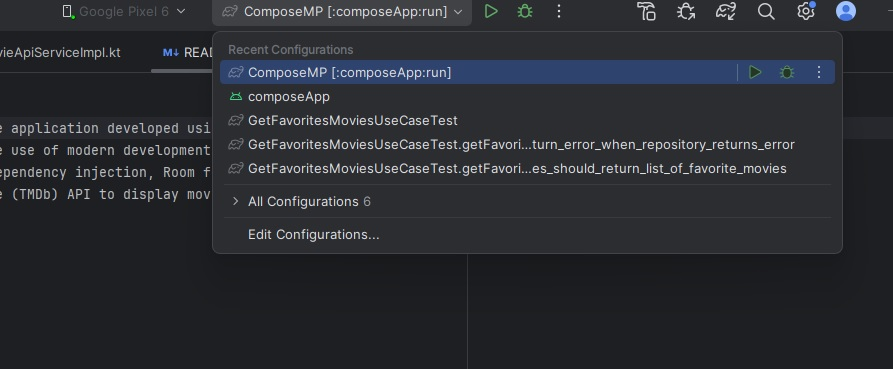

# MovieApp

MovieApp project is a cross-platform movie application developed using Compose Multiplatform. The app is designed to run on Android, iOS,
and Desktop platforms. It demonstrates the use of modern development practices, including MVVM architecture, 
Clean Architecture principles, Koin for dependency injection, Room for local database management, Ktor for network requests, and Kotlin Flows. 
The app integrates with The Movie Database (TMDb) API to display movie information and allows users to save their favorite movies locally.

## Table of Contents

- [Features](#features)
- [Architecture](#architecture)
- [Technologies Used](#technologies-used)
- [Setup](#setup)
- [Unit Tests](#unit-tests)
- [Contributing](#contributing)

## Features

- Display popular, top-rated, and upcoming movies using the TMDb API.
- Search for movies across the entire TMDb database.
- Save favorite movies locally using Room Database.
- View detailed information about each movie, including images, reviews, and YouTube video trailers (YouTube trailers do not work on iOS).
- Cross-platform support for Android, iOS, and Desktop.

## Architecture

The app is built using the following architectural principles:

- **MVVM (Model-View-ViewModel)**: For managing UI-related data in a lifecycle-conscious way.
- **Clean Architecture**: Separates the codebase into distinct layers, improving testability, maintainability, and scalability.
- **Dependency Injection**: Managed through Koin, allowing for easy dependency management across all platforms.

## Technologies Used

- **Compose Multiplatform**: UI toolkit for creating native user interfaces across multiple platforms.
- **Ktor**: For making network requests to the TMDb API.
- **Room Database**: For local data storage, adapted for Compose Multiplatform.
- **Koin**: For dependency injection across Android, iOS, and Desktop platforms.
- **Kotlin Flows**: For asynchronous data streams.
- **Coroutines**: For managing background threads and asynchronous tasks.

## Setup

### Prerequisites

- **Android Studio**: Download and install from [here](https://developer.android.com/studio).
- **JDK 11 or later**: Ensure you have the appropriate JDK version installed.
- **Xcode** (for iOS, if on macOS): Download and install from the [Mac App Store](https://apps.apple.com/us/app/xcode/id497799835?mt=12).

### Registering for TMDb API Key

To use the app, you need to register for an API key from The Movie Database (TMDb):

1. Visit [TMDb](https://www.themoviedb.org/signup) and create an account.
2. After logging in, navigate to your account settings.
3. In the API section, create a new API key.
4. Copy your API key for later use.

### Adding the API Key

To make the app work properly, you need to add the API key to the `MovieApiServiceImpl` class:

```
class MovieApiServiceImpl {
    companion object {
        const val API_KEY = "your_api_key_here"
    }
}
```
Replace `"your_api_key_here"` with your actual TMDb API key.

### Running the App

1. **Android**:
    - Open the project in Android Studio.
    - Set up an Android emulator or connect a physical device.
    - Run the app using the `Run` button.

2. **Desktop**:
    - From the terminal or Android Studio, run the `desktopMain` task to start the desktop application.
    - 
    - Note for Windows users: If you encounter issues running the desktop app, ensure that the PATH variables for Java and the path to Java in Android Studio are the same. You may need to install the latest version of Java. You can download it from the [Oracle website](https://www.oracle.com/java/technologies/downloads/)

3. **iOS** (if available):
    - Open the project in Xcode on a macOS machine.
    - Set up an iOS simulator or connect a physical device.
    - Run the app using Xcode.

## Unit Tests

The project includes unit tests for the common codebase, ensuring the core functionality works across all platforms. The tests are written using Kotlin test libraries and follow the same architecture principles used in the main app.

## Contributing

Contributions are welcome! If you have any improvements or new features, feel free to submit a pull request. For any major changes, please open an issue first to discuss what you would like to change.


